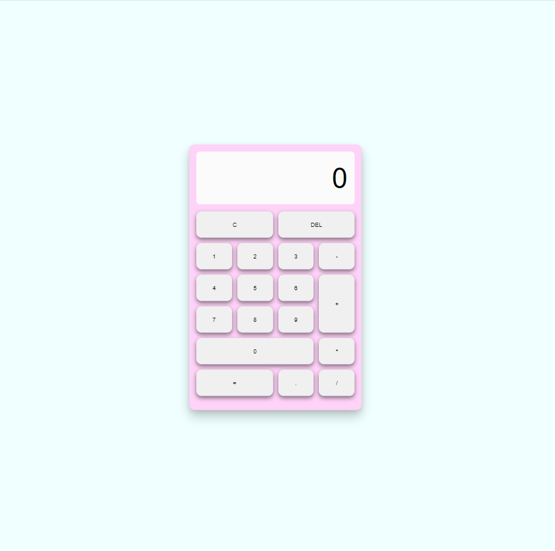

# Calculadora Básica

Una calculadora básica desarrollada en HTML, CSS y JavaScript que permite realizar operaciones aritméticas simples como suma, resta, multiplicación y división.

## Descripción

Esta calculadora permite realizar las siguientes operaciones:
- Suma
- Resta
- Multiplicación
- División

## Captura de Pantalla

 

## Características

- Interfaz de usuario simple y amigable.
- Capacidad para realizar operaciones aritméticas básicas.
- Manejo de eventos en JavaScript para la interactividad.

## Tecnologías Utilizadas

- HTML
- CSS
- JavaScript

## Objetivo de Aprendizaje

El objetivo de este proyecto es familiarizarse con los fundamentos del desarrollo web utilizando HTML, CSS y JavaScript. Aprenderás cómo estructurar una página web, aplicar estilos y agregar interactividad con JavaScript.

## Instrucciones de Uso

1. Clona este repositorio:
   ```bash
   git clone https://github.com/angel-ayaya/calculadora-basica.git
